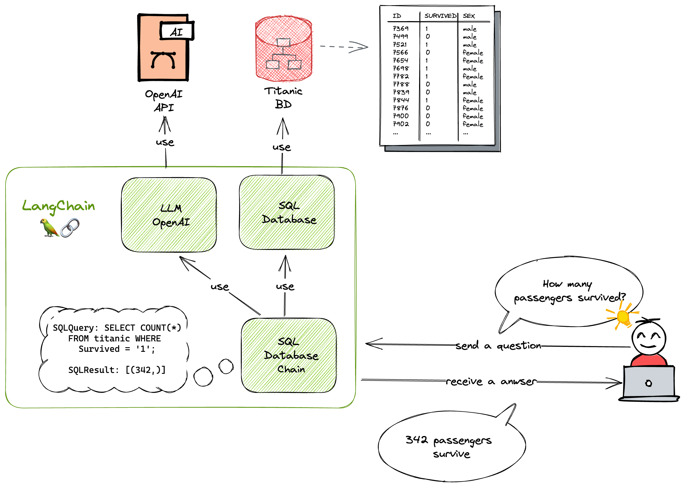

# NextJS App using LangChain, Titanic SQLite Database and the API of OpenAI

The main goal of this app is to use the Titanic SQLite database to explore the [LangChain](https://js.langchain.com/) library and the API of [OpenAI](https://openai.com/).

I'm using the [SqlDatabaseChain](https://js.langchain.com/docs/modules/chains/other_chains/sql) of LangChain in order to interact with the database in a natural language way on the client side.

I'm also using [Next.js](https://nextjs.org/) to create a simple web application that allows me to interact with the database through the API of OpenAI.

I made a similar approach with [Jupyter Notebook](https://github.com/brunogarcia/langchain-titanic-sqlite).



## Database

The table is called `titanic` and has the following columns.

| Column Name | Data Type | Description                           |
| ----------- | --------- | ------------------------------------- |
| PassengerId | TEXT      | Unique identifier for each passenger  |
| Survived    | TEXT      | Whether the passenger survived or not |
| Pclass      | TEXT      | Passenger class                       |
| Name        | TEXT      | Passenger name                        |
| Sex         | TEXT      | Passenger gender                      |
| Age         | TEXT      | Passenger age                         |
| SibSp       | TEXT      | Number of siblings/spouses aboard     |
| Parch       | TEXT      | Number of parents/children aboard     |
| Ticket      | TEXT      | Ticket number                         |
| Fare        | TEXT      | Ticket fare                           |
| Cabin       | TEXT      | Cabin number                          |
| Embarked    | TEXT      | Port of embarkation                   |

## Answering the questions with natural language

The app is able to answer the following questions:

1. How many passengers survived?
2. How many passengers were in each class?
3. How many passengers survived/died within each class?
4. What was the average age of survivors vs non-survivors?
5. What was the average age of each passenger class?
6. What was the average fare by passenger class? By survival?
7. How many siblings/spouses aboard on average, by passenger class? By survival?
8. How many parents/children aboard on average, by passenger class? By survival?

### Example #1: How many passengers survived?

```html
342 passengers survived.
```

### Example #2: How many passengers were in each class?

```html
There were 216 passengers in first class, 184 passengers in second class, and
491 passengers in third class.
```

## Run on development mode

Remember to rename the file `.env.example` to `.env.local` and fill in with your [OpenAI API key](https://platform.openai.com/account/api-keys)

```shell
npm run dev
```
